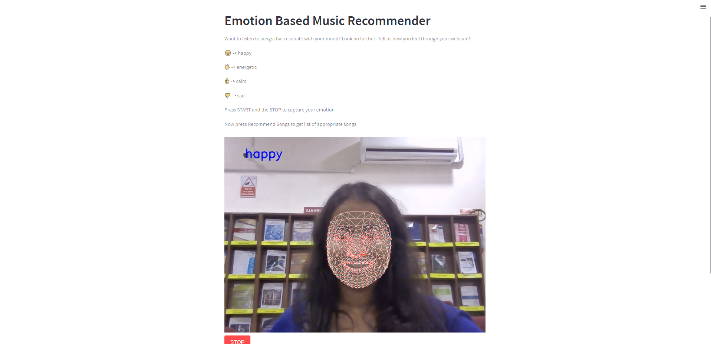
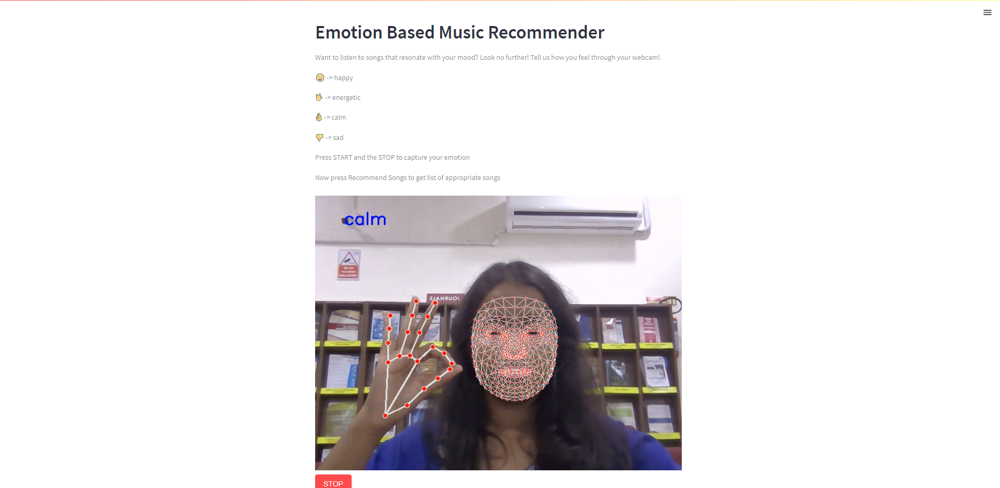
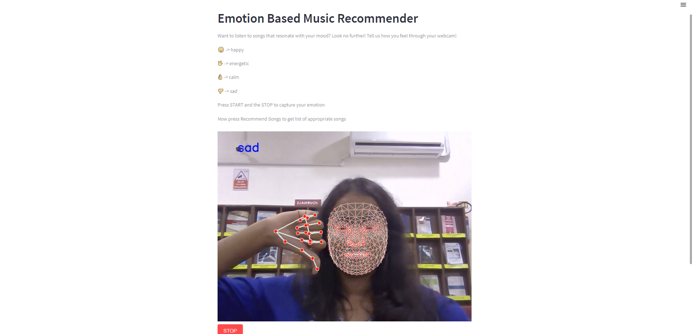
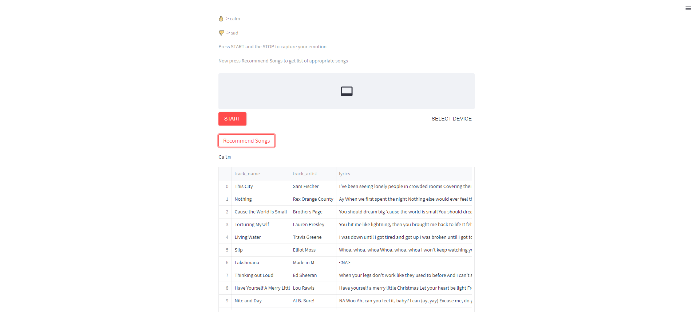

# Tunes of Mood 🎵🌟🚀

## Overview

Tunes of Mood is a project that leverages hand gestures and facial expressions to detect the user's mood. The goal is to create a unique and interactive experience where the user's emotions can be translated into recommended songs. The project utilizes a combination of Keras, OpenCV, NumPy, Mediapipe, and Streamlit to achieve mood detection and song recommendations.

## Features

- Mood detection through hand gestures and facial expressions.
- Recommendation of songs based on the detected mood.
- User-friendly interface powered by Streamlit.

## Tech Stack

- Keras
- OpenCV
- NumPy
- Mediapipe
- Streamlit

## Getting Started

1. Clone the repository:

   ```bash
   git clone https://github.com/Deepa1172/Tunes-of-Mood.git
   ```

2. Run the Streamlit app:

   ```bash
   streamlit run app.py
   ```

3. Interact with the app to experience mood detection and song recommendations.

## Screenshots

### Energetic 💥


### Happy 😄


### Calm 😌


### Sad 😞


### Recommended Songs Based on Mood 🎵


## Contributing

If you'd like to contribute to Tunes of Mood, please follow our [Contribution Guidelines](CONTRIBUTING.md).

## License

This project is licensed under the MIT License - see the [LICENSE](LICENSE) file for details.
